Finance Manager_android mobile app:

Description : *This app helps to manage Accounting, Asset Lifcycle management and Budgeting for the MSME (Micro Small Medium Enterprises).

Features of the app : 
   (MVP ready) *User can add a transaction entry; 
               *User can view automatic Ledger accounts, Trial balance, Income statement, and Balance sheet.

App Structure : 
   *Home tab;
   *Accounting tab;
   *Assets tab;
   *Budgeting tab
    - all four inside Bottom navigation bar. 
   *Accounting tab contains -> Main screen with analytics dashboard, top app bar with three different screens' text buttons (Journal, Ledger, Report). *Each screen is designed with Top app bar, Lazycolumn or LazyGrid. *Room database feature integrated for real storage of user's app data.

Tech stack : 
   *Language - Kotlin. 
   *UI framework - Jetpack compose.
   *Architecture - Clean architecture (MVVM).
   *Database - Room DB.

Architecture :
   *MVVM used, domain layer(model, usecase, repo interfaces);
               data layer(hilt setup, database model, dao, room repository); 
               UI layer(viewmodel, screen classes, typesafe navigation).

Project status : Accounting module' MVP completed.

What learnt from this project journey :
   Hilt dependency injection setup and usage,
   typesafe navigation,
   database migration in Sqlite,
   compose components such as LazyGrid and ExposedDropdownMenu.

Future improvements : 
   *Adding Export menu inside Report screen to export the income statements as pdf and Date wise selection of entry and pending modules of Assets and Budgeting. 
   *Improved UI with better colors and themes for UI components. *Rest API integration for remote data transferring.

## Screenshots

### Accounting Main
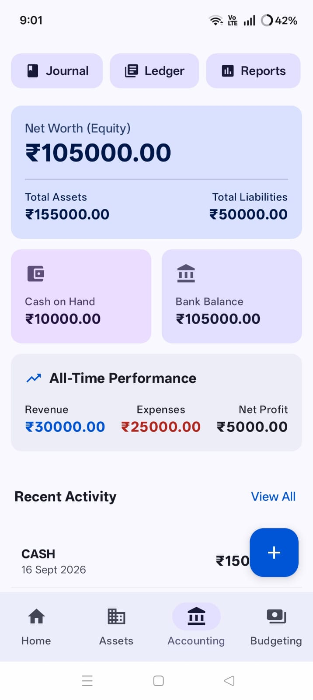

### Recent Transactions
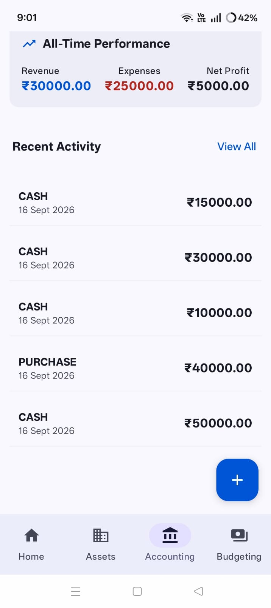

### Add Transaction Form
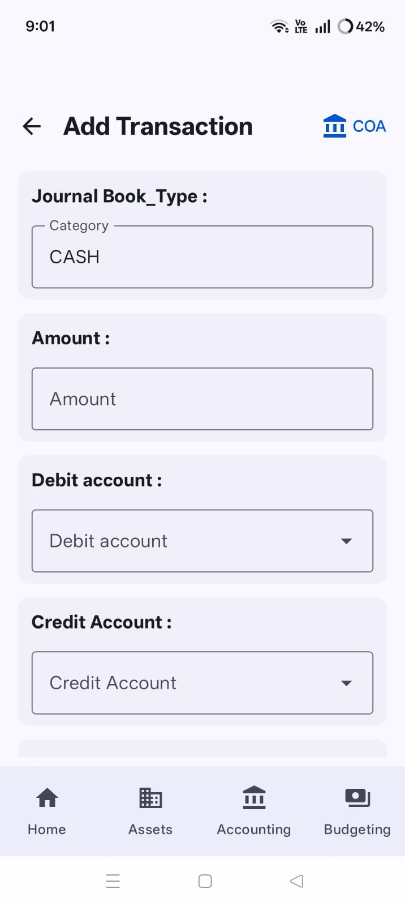

### Add Transaction Form - Save
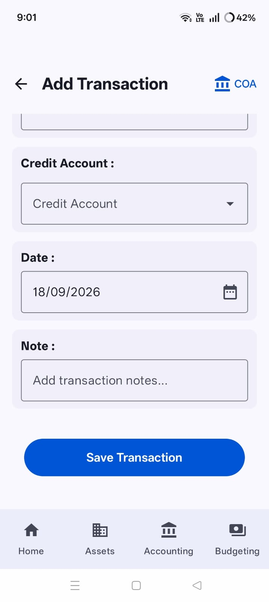

### Chart of Accounts
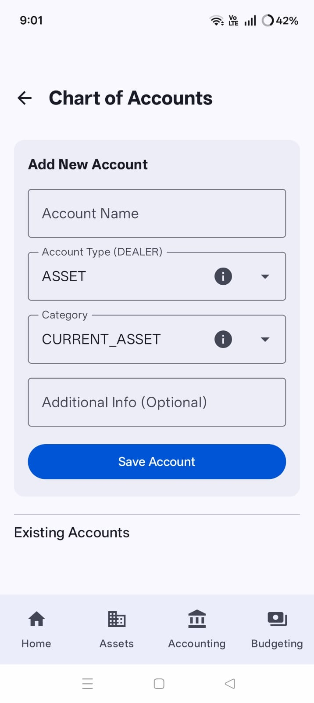

### COA List
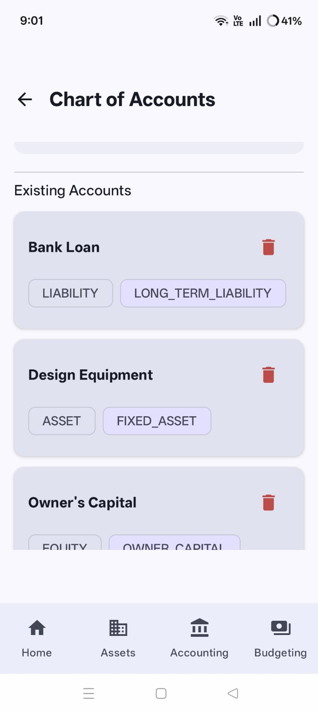

### Journal Entries
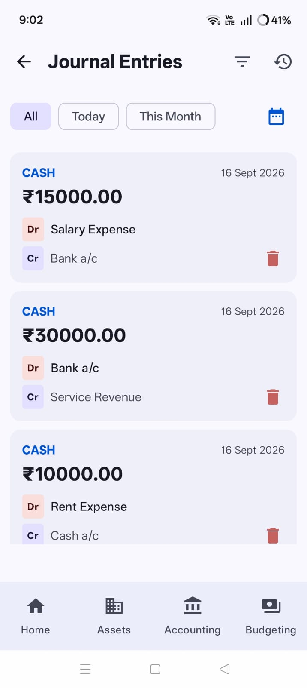

### Transaction History
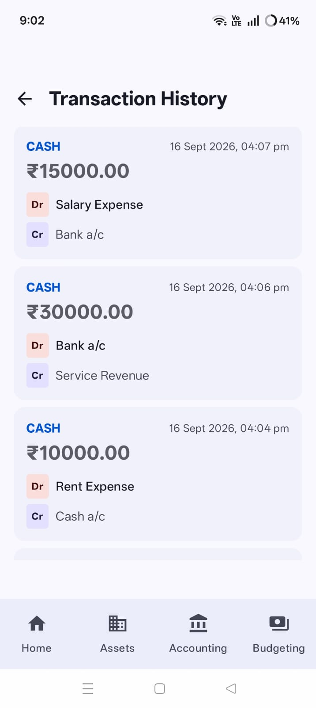

### Ledger
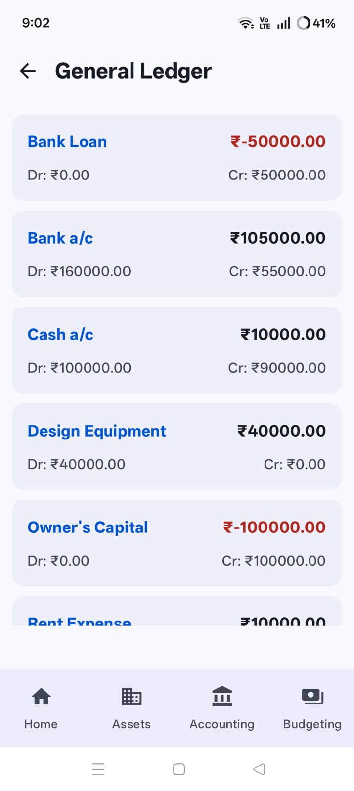

### Report Screen
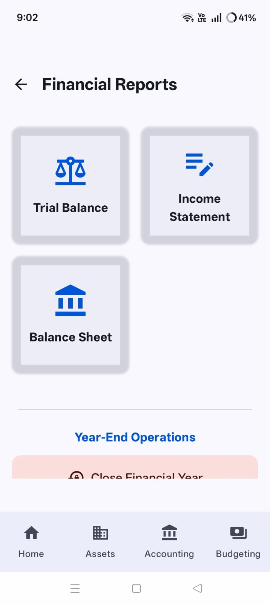

### Trial Balance
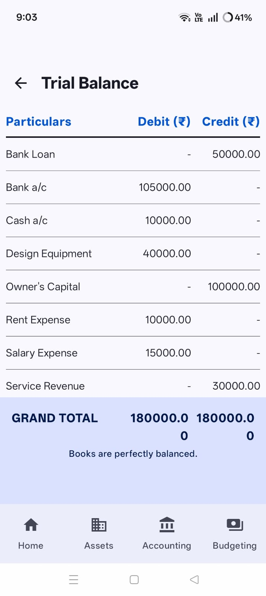

### T Account
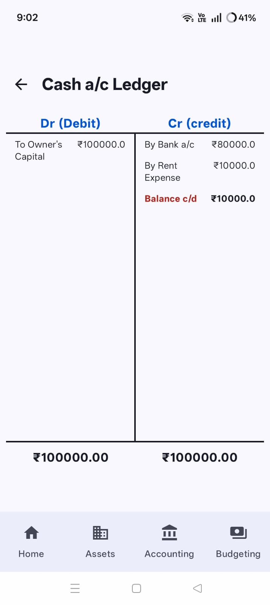

### Income Statement
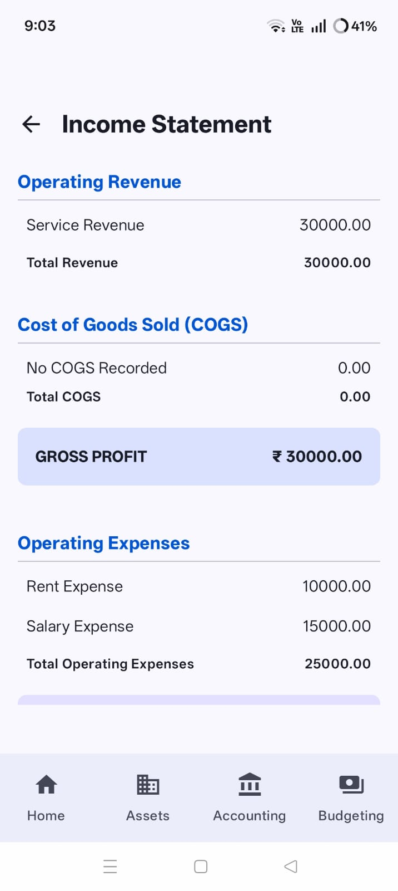

### Income Statement - Additional View
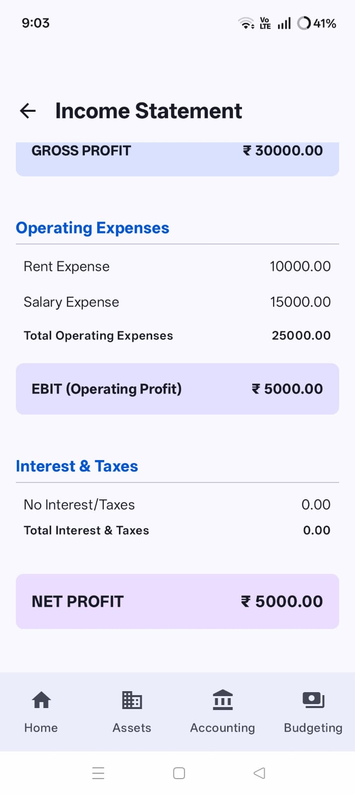

### Balance Sheet
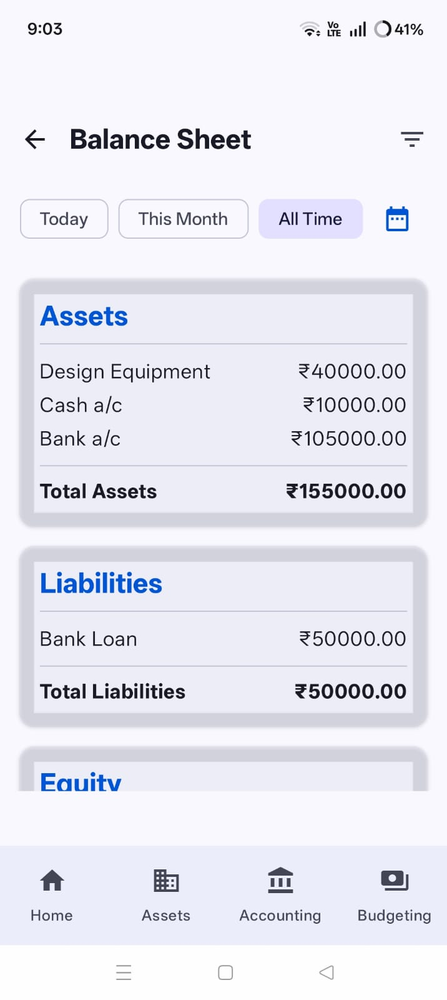

### Balance Sheet - Additional View
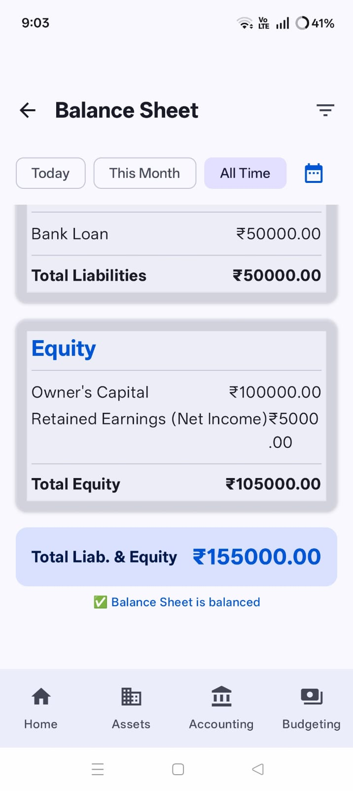

### Post Trial Balance
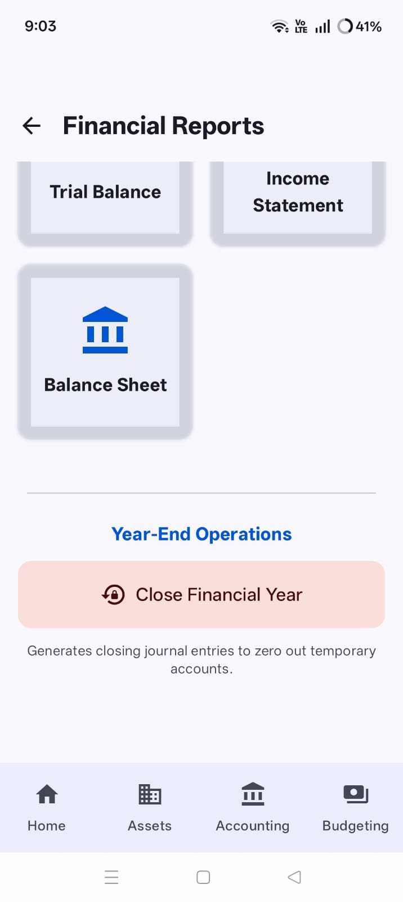

### Post Trial Balance Confirmation
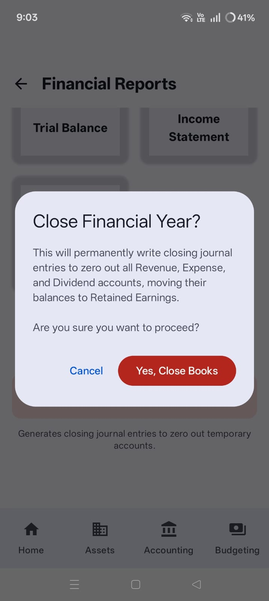

### Home
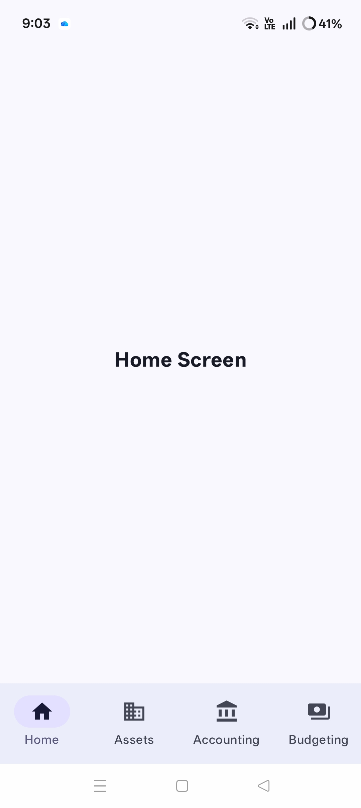

### Assets
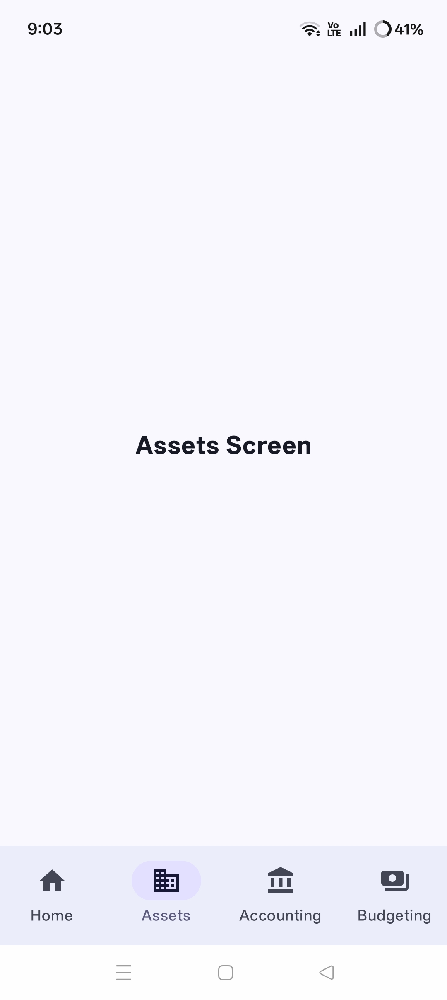

### Budgeting
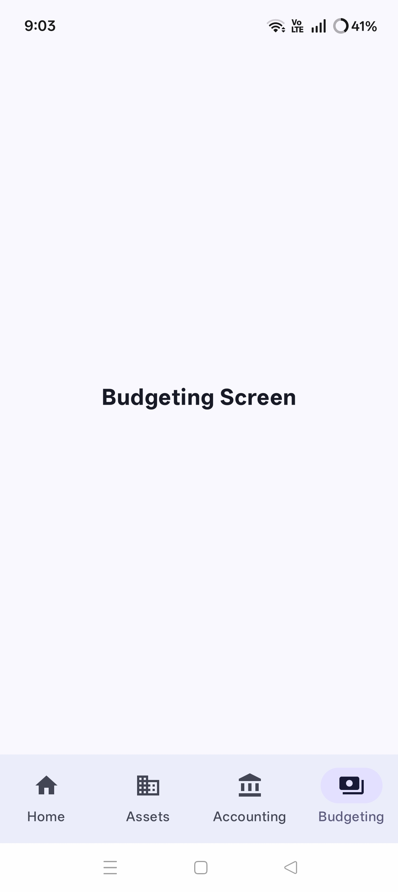

